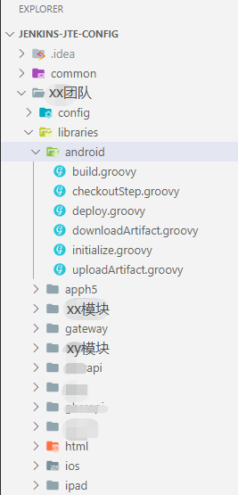
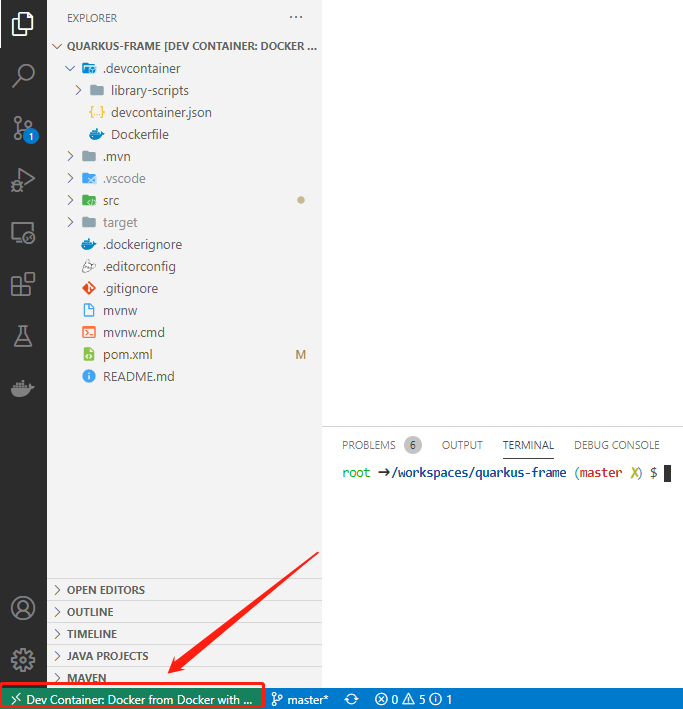

# 叨叨技术

大家好，我是 `小叨 Douglas` ， 一个默默无闻的 `Java` 程序猿，大家可以叫我 `小叨`，`老叨`，`老D` 什么的都可以，初次见面，请多关照~

这是我个人首次开始写文章，得益于我工作项目的关系，我能够有时间潜心研究一些比较**冷门、偏门的技术**并用于工作当中，其中不乏有：

+ 《深入 `Jenkins` 探坑》系列
+ 《删掉 `IDEA` 用 `VSCode` 》系列
+ 《不如搭个 `Quarkus` 脚手架》系列

等等...

网上很容易就找得到的**填坑方法**我就不再写了，我这里只会写一些网上找不到解决方案的，凭自己的头发踩坑踩出来的经验教训，以及一些教程给大家参考讨论，如果愿意的话也可以陪我一起趟坑（激动脸！）哦~

下面容我简单介绍下为什么是这三个系列：

## `《深入Jenkins探坑》`系列

因为工作的关系，我需要翻转再翻转 `Jenkins` ，把 `Jenkins` 可以实现的功能通通研究透，并落地到公司的开发团队里面，比如：

+ 用 `JTE 插件`统一管理 `Jenkinsfile`
+ 如何并行触发远程 `Jenkins` 任务？
+ 教你如何动态创建、自动销毁 `Jenkins agent`
+ 你尝试过用 `Linux` 编译 `iOS` 吗？
+ 跟我一起写《下载maven仓库制品包》的插件

## `《删掉IDEA用VSCode》`系列

因为荷包的关系（荷包空落落...），决定不用 `Idea`
转去用 `VS Code`。`VSCode` 给到我的第一印象是安装包小，启动超级快，很多牛逼功能可以通过安装插件实现，当然坑位也不少，比如：

+ 通过插件容器化本地开发环境
+ VSCode巨坑之连接远程docker

## `《不如搭个Quarkus脚手架》`系列

这个算是我作为一个`Java`程序猿的一个症结了，我自己亲手搭建的脚手架有：`Springboot`单体`web`应用脚手架，`Springcloud`微服务脚手架。我很喜欢在自己的脚手架里折腾各种各样的通用功能，比如统一权限管理，`redis`集成，`quartz`集成，分布式`redisson`集成等等；还喜欢集成一些小功能，比如ID生成器，DTO转换器。

大概在去年，我又逛到了一个新的云原生框架 `Quarkus` ，手又开始痒了，所以就准备了这一个系列，想把这个搭建的过程通过文章的形式分享出来，一起讨论一起踩坑！

---

上面的一些经验，有些已经落地，有些是通过踩坑之后发现暂时落不了地的。不过都还没来得及写成文章，所以我会在以后的日子里慢慢地总结出来给到大家。

## 最后

让我们一起学习，一起进步，一起头秃~
