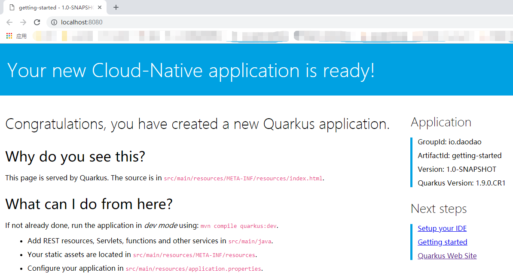

# Quarkus框架入门 - （1）启动HelloWorld

原标题：Quarkus框架入门 - （1）启动HelloWorld

作者：Roger_Luo  

---

## 前言

在 `Java` 领域，相信各位大佬对 `Spring` 全家桶框架用得已经是滚瓜烂熟了，我也是几年前就做了两个脚手架了，一个是基于 `springboot` 的单体Web脚手架，一个是基于 `spring cloud` 的微服务脚手架。

大概在去年前我也留意到一个 `Red Hat` 开源的 `Java` 框架 `Quarkus` ，定位为 `GraalVM` 和 `OpenJDK HotSpot` 量身定制的一个 `Kurbernetes Native` 云原生 `Java` 框架，不过当时刚刚 `1.0` Release，猜测应该还不算太成熟，所以当时也没有深入研究。

现在一个转身，发现已经Release到 `1.8.3.Final` 了，每次的Release都会有长长的Issue列表被修复，由此可见社区的活跃度、更新的速度都是非同凡响的，证明有很多开发者投入到了这个框架的完善工作上。而且我也发现很多扩展都已经达到了生产可用的状态，像是有 `Hibernate ORM Panache` ， `Hibernate validator` 等等。

正因为此，我灵光一闪，想基于 `Quarkus` 来一步一步地搭建一个脚手架，做一个 `跟我来搭Quarkus脚手架系列` 的文章，把我搭建过程中各种大坑小坑、各种经验等，通过文字的形式记录下来，供大家一起参考探讨其中的奥秘。

既然要搭脚手架，首先咱们得先熟悉这个全新的框架 `Quarkus`，那通过官方的 Hello world 教程来上手就是不二之选了哈，下面来一起开始入门。

## 坑位预警

> 所谓坑位预警，就是我会把趟过的各种大坑小坑，放到文章开头的这里进行说明，让大伙们首先有个心理预期...毕竟在这个世界上，除了坑，就只有坑了（捂脸）。

1. `Quarkus` 这个框架可以用平时的 `Java JDK` 环境就可以进行开发调试，但是如果想体验 `Native` 原生的话，本地机器里还需要安装 `Graalvm`，以及 `(windows)Visual Studio 2017` 或者 `(macOS)XCode` 才可以构建native应用，光这个 `Visual Studio` 就好几个GB嘞... 当然也可以在本地安装 `docker` 环境，用 `docker` 镜像去构建。
2. 如果想用 `docker` 环境去构建的话，就引出**第二个大坑**（我就掉进去了一周而已...），现在的 `Quarkus` 暂不支持调用远程 `docker` 去构建，因为构建命令是使用 `-v` 参数将jar包引用到镜像里面做原生构建，这样就会发生将本地的路径直接贴到了 `-v` 后面了。具体问题可参考 [issues-1610](https://github.com/quarkusio/quarkus/issues/1610)。

## 准备环境[<sup>[1]</sup>](#参考文章)

+ IDE，比如 [VSCode](https://code.visualstudio.com/)
+ JDK 11 环境（`JAVA_HOME` 要设置好）
+ maven 或者 gradle

如果要编译原生的话，还要准备下面：

+ `GraalVM version 20.2.0` (Java 11版本)，具体下载安装[参考这里](https://quarkus.io/guides/building-native-image#configuring-graalvm)
+ C 编译开发环境，就是我上面说的 `(windows)Visual Studio 2017` 或者 `(macOS)XCode`，具体[参考这里](https://quarkus.io/guides/building-native-image#configuring-c-development)

或者直接安装docker环境：

+ (windows)安装 [docker desktop](https://hub.docker.com/editions/community/docker-ce-desktop-windows)

## 创建Hello World项目[<sup>[2]</sup>](#参考文章)

> 代码示例在 `example` 目录。

参考[官方教程](https://quarkus.io/guides/getting-started#bootstrapping-the-project)，我们用 `maven` 来创建项目：

### Linux & MacOS

```shell
mvn io.quarkus:quarkus-maven-plugin:1.8.3.Final:create \
    -DprojectGroupId=io.daodao \
    -DprojectArtifactId=getting-started \
    -DclassName="io.daodao.resource.GreetingResource" \
    -Dpath="/hello"
```

### cmd

```cmd
mvn io.quarkus:quarkus-maven-plugin:1.8.3.Final:create -DprojectGroupId=io.daodao -DprojectArtifactId=getting-started -DclassName="io.daodao.resource.GreetingResource" -Dpath="/hello"
```

### Powershell

```powershell
# VSCode Terminal
mvn io.quarkus:quarkus-maven-plugin:1.8.3.Final:create "-DprojectGroupId=io.daodao" "-DprojectArtifactId=getting-started" "-DclassName=io.daodao.resource.GreetingResource" "-Dpath=/hello"
```

它会生成到目录 `./getting-started` 里面：

+ 经典的 `Maven` 结构
+ 生成 `io.daodao.resource.GreetingResource.java` 文件，并暴露 `/hello` 接口
+ 生成对应的unit test
+ 生成一个默认的页面，当访问 `http://localhost:8080` 时可以看到
+ 在 `src/main/docker` 目录里自动生成 `Dockerfile` 文件，包括 `native` 和 `jvm modes` 两种构建方式
+ 生成应用的配置文件 `application.properties`

## GreetingResource.java

首先我们来看看这个唯一的类，实际就是 `Restful` 接口，按照 `Restful` 思想，接口即资源，所以叫 `Resource`，相当于 `Spring` 的 `Controller`。

该类中实现一个 `/hello` 接口，参考如下：

```java
package io.daodao.resource;

import javax.ws.rs.GET;
import javax.ws.rs.Path;
import javax.ws.rs.Produces;
import javax.ws.rs.core.MediaType;

@Path("/hello")
public class GreetingResource {

    @GET
    @Produces(MediaType.TEXT_PLAIN)
    public String hello() {
        return "hello";
    }
}
```

很简单有木有！而且也没有像Spring Boot框架一样编写main方法入口。

## 启动应用

既然没有main入口，那怎么启动呢？很简单：

```bash
# 用项目自带的mvnw
./mvnw compile quarkus:dev

# 或者用系统带的maven
mvn compile quarkus:dev
```

启动日志如下，这样就启动完了！

```cmd
Listening for transport dt_socket at address: 5005
__  ____  __  _____   ___  __ ____  ______
 --/ __ \/ / / / _ | / _ \/ //_/ / / / __/
 -/ /_/ / /_/ / __ |/ , _/ ,< / /_/ /\ \
--\___\_\____/_/ |_/_/|_/_/|_|\____/___/
2020-10-16 16:25:27,662 INFO  [io.quarkus] (Quarkus Main Thread) getting-started 1.0-SNAPSHOT on JVM (powered by Quarkus 1.9.0.CR1) started in 2.330s. Listening on: http://0.0.0.0:8080
2020-10-16 16:25:27,664 INFO  [io.quarkus] (Quarkus Main Thread) Profile dev activated. Live Coding activated.
2020-10-16 16:25:27,664 INFO  [io.quarkus] (Quarkus Main Thread) Installed features: [cdi, resteasy]
```

## 接口调用

既然启动完了，那咱们调用一下！

在 `VSCode` 里新建一个 `Terminal` ，`curl` 一下 `/hello` 接口：

```powershell
C:\ > curl http://localhost:8080/hello

StatusCode        : 200
StatusDescription : OK
Content           : hello
RawContent        : HTTP/1.1 200 OK
                    Content-Length: 5
                    Content-Type: text/plain;charset=UTF-8

                    hello
Forms             : {}
Headers           : {[Content-Length, 5], [Content-Type, text/plain;charset=UTF-8]}
Images            : {}
InputFields       : {}
Links             : {}
ParsedHtml        : mshtml.HTMLDocumentClass
RawContentLength  : 5
```

可以看到返回了 `"hello"` ，说明成功调用了接口。

接下来我们打开下 `http://localhost:8080`：



大功告成~

如果想停止进程，我们只需要 `CTRL+C` 就可以。

## 最后的话

下一节我们详细分析讲解这个 `HelloWorld` 项目。敬请关注~

## 参考文章

[1] [Quarkus官方教程：Build a native executable](https://quarkus.io/guides/building-native-image)

[2] [Quarkus官方教程：Getting started](https://quarkus.io/guides/getting-started)
