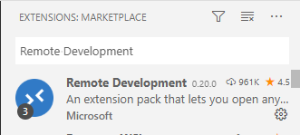
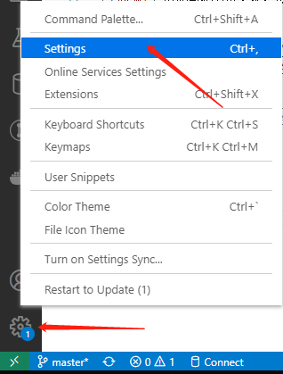
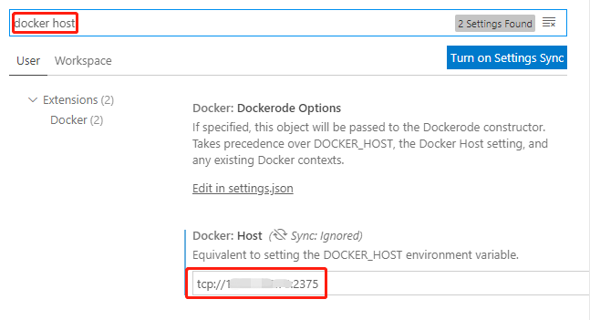
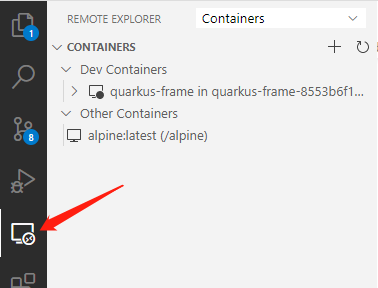

# VSCode 之容器开发环境搭建 (Remote-Containers)

原标题：VSCode 之容器开发环境搭建 (Remote-Containers)

作者：小杰杰

---

## 前言

相信各位程序猿们在自己电脑里打开 IDE 敲代码什么的已经是娴熟到不行了，在电脑里安装 `java sdk`, `nodejs`, 这些基础操作也是熟练到炸裂了，不过大家有没有想象过将开发环境迁移到容器里面？或者说开发环境代码化？自己的电脑只需要装好 IDE，连接到容器里就可以立刻开发编译，听起来是不是有点小激动呢？

最近，微软发布一组 `VSCode` 插件 `Remote-Development` 。它可以让开发者在 `VSCode` 中直接访问远程的目录进行开发工作。这样我们的代码和开发环境就可以和终端电脑分离了，可以避免对本机环境的污染，并且可以随意在远端搭建多个不同的开发环境随时切换，结合容器技术可以有效的将不同的开发环境进行区隔，并且以容器为单位，进行复制、迁移，甚至可以在小组内对同样的环境需求进行打包、分发，新入职的同学不需要再搭建环境，连上容器直接进入开发。下面让我来带领大家由浅到深的搭建这样的远端开发环境吧。

## 坑位预警

所谓坑位预警，就是我会把趟过的各种大坑小坑，放到文章开头的这里进行说明，让大伙们首先有个心理预期...毕竟在这个世界上，除了坑，就只有坑了（捂脸）。

1. `Remote-Containers` 这一套插件现在的功能很多都是基于**电脑本机**安装的 `docker` 容器环境，虽然它支持连接到远端的 `docker` 容器，不过连接到远端之后会有很多额外的设置需要弄了...

2. 如果你的开发环境里还需要编译 docker 镜像这种功能的话（比如你想编译 `Quarkus` 框架的 `native` 镜像。不要问，我还在坑里爬不出来...），辣就有更多乱七八糟的奇珍异兽级别的错误涌出来嘞。当然了，如果只是通过 `maven` 或者 `gradle` 编译个 `jar` 包 `war` 包的话还是可以轻松实现的。

## 准备环境

一共需要以下几样工具：

1. `VSCode` 本体
2. `Remote-Developement` 插件
3. `Docker CLI` (因为插件需要用到本机的 docker 命令)

>**注意**：在这里我会分开两个场景去说明：
> + `[本地]`：代表 docker 环境直接安装在本地电脑。
> + `[远端]`：代表 docker 环境安装在远端服务器。

### 1. 安装 VSCode

自己度娘[下载链接](https://code.visualstudio.com/)去~ 略过！

### 2. 安装插件

按 `Ctrl+Shift+X` 打开插件界面，搜 `Remote Development` 安装即可。



### 3. 安装docker

`[本地]` 如果想直接安装到本地电脑里，使用本地的 docker 环境，那么安装 [docker desktop](https://hub.docker.com/editions/community/docker-ce-desktop-windows)，安装好本地就会有个 docker 环境。

`[远端]` 如果本地不想安装，想链接到远端服务器的 docker，那么安装 docker-cli 即可。（当然，坑最多...）

1. 下载 [docker.exe](https://github.com/StefanScherer/docker-cli-builder/releases/)，放到 `PATH` 路径里，让命令行可以直接使用 `docker` 命令即可。

2. 在 `cmd` 或者 `power shell` 里面打 `docker info` 命令，看到有东西出来就可以了。

### 4. `[远端]` 开启 docker 远程调用 api 功能[<sup>[1]</sup>](#参考文章)

跑下面的命令，创建 `override.conf` 文件，然后重启 `docker` 进程即可。

```bash
# create folder
$ sudo mkdir /etc/systemd/system/docker.service.d/

# create conf file
$ sudo vi /etc/systemd/system/docker.service.d/override.conf

# 添加下面内容到override.conf
[Service]
ExecStart=
ExecStart=/usr/bin/dockerd -H fd:// -H tcp://0.0.0.0:2375 --containerd=/run/containerd/containerd.sock
```

> 注意： `tcp://0.0.0.0:2375` 的端口号可以根据自己需要修改。

### 5. `[远端]` 设置 VSCode[<sup>[2]</sup>](#参考文章)

> 叨叨注：是的，连接远端docker的话要设置下面的东西，耶~

在 vscode 里打开 `settings`：



搜索 `docker host`，在下面列出的位置里填写远端 `docker` 的地址：



## 测试一下

都设置完之后，点开 `Remote Explorer`，如果能够看到 docker 的容器信息，辣就是成功嘞。



## 最后

让我们一起学习，一起进步，一起头秃~

欢迎关注我的个人公众号哈！公众号私信我秒回~


## 参考文章

[1] [Docker官方教程：Enable the remote api for dockerd](https://success.docker.com/article/how-do-i-enable-the-remote-api-for-dockerd)

[2] [Microsoft官方教程：Developing inside a container on a remote Docker host](https://code.visualstudio.com/docs/remote/containers-advanced#_developing-inside-a-container-on-a-remote-docker-host)
