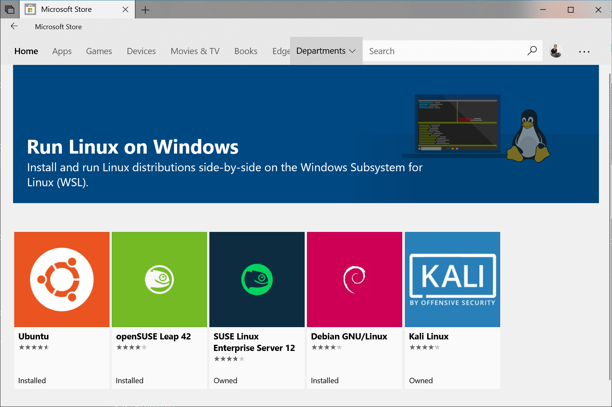
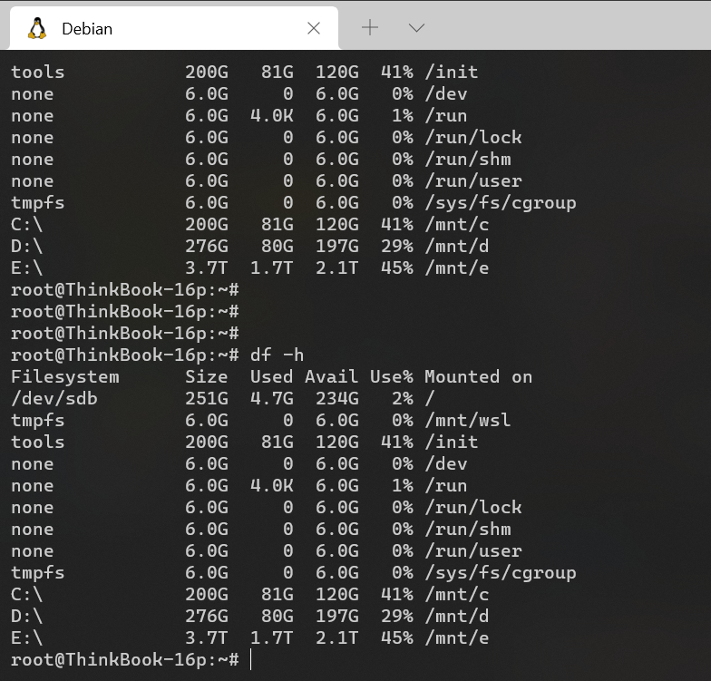
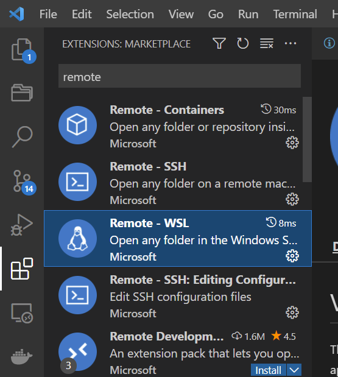
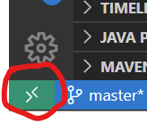
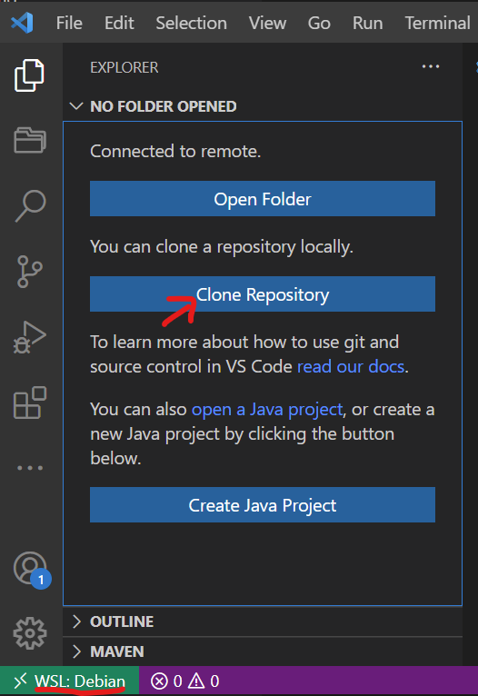

# VSCode之WSL开发环境搭建入门 (Remote-WSL)

原标题：VSCode之WSL开发环境搭建入门 (Remote-WSL)

作者：老叨_Douglas  

---

## 前言

上一篇讲了用容器搭建开发环境的教程，这次讲解的是用微软很香的 `WSL(Windows Subsystem for Linux)`[<sup>[1]</sup>](#参考文章) 来安装本地的 `linux` 系统，并且在里面原生地安装 `docker`， 以及你各种想装的服务器程序。

香的不行！马上往下看~

## 什么是 WSL ?

这里先简单介绍一下 `WSL` 是什么东西：

`WSL` 是 `Windows Subsystem for Linux` 的缩写，意思是 `Windows` 内的 `Linux` 子系统。

Linux 子系统让开发人员无需虚拟机就可以直接在 Windows 上运行 Linux 环境，包括大多数命令行工具、程序和应用，包括 docker / podman 等容器环境。这样开发人员就不需要像以前那样，自己买云服务器来玩了。

使用 WSL 的好处是：

1. 与在虚拟机下使用 Linux 相比，WSL 占用资源更少，更加流畅；
2. WSL 可以对 Windows 文件系统下的文件直接进行读写，文件传输更方便；
3. 剪贴板互通，可以直接在 Windows 下其它地方复制文本内容，粘贴到 WSL；
4. 可以直接使用 WSL 内的环境配置，例如 JDK, maven, nodejs, docker 等；

## Windows 安装运行 WSL2 的要求

`WSL2` 需要 `Windows 10` 并且满足以下版本要求：

- 对于 `x64` 系统：版本 `1903` 或更高版本，采用 **内部版本** `18362` 或更高版本。
- 对于 `ARM64` 系统：版本 `2004` 或更高版本，采用 **内部版本** `19041` 或更高版本。
- 低于 `18362` 的版本不支持 `WSL2`。 需要更新 `Windows` 版本。

## WSL 2 简易安装步骤

网上已经有很多安装教程了，官方的安装教程也已经非常清晰了，大家可以看着官方教程就可以搞定，当然啦，下面是总结的简易步骤供参考：

1. 启用适用于 Linux 的 Windows 子系统，并且启用虚拟机功能

    ```powershell
    ## 以管理员身份打开 PowerShell 并运行：

    # 1. 先启用“适用于 Linux 的 Windows 子系统”可选功能，然后才能在 Windows 上安装 Linux 分发。
    dism.exe /online /enable-feature /featurename:Microsoft-Windows-Subsystem-Linux /all /norestart

    # 2. 安装 WSL 2 之前，必须启用“虚拟机平台”可选功能。 计算机需要虚拟化功能才能使用此功能。
    dism.exe /online /enable-feature /featurename:VirtualMachinePlatform /all /norestart
    ```

2. **重新启动** 计算机，以完成 `WSL` 安装并更新到 `WSL 2`。

3. 下载 Linux 内核更新包：[适用于 x64 计算机的 WSL2 Linux 内核更新包](https://wslstorestorage.blob.core.windows.net/wslblob/wsl_update_x64.msi)

4. 将 WSL 2 设置为默认版本

    ```powershell
    # 打开 PowerShell，然后在安装新的 Linux 发行版时运行以下命令，将 WSL 2 设置为默认版本：
    wsl --set-default-version 2
    ```

## 安装 `Debian` 子系统

上面的步骤做完之后，`WSL2` 就启用成功了！大家就可以安装自己喜欢的 Linux 系统了，下面的是支持安装的 Linux 系统，大家可以按照自己的喜好挑着安装：

> 单击以下链接会打开每个分发版的 Microsoft Store 页面：
>
> - [Ubuntu 18.04 LTS](https://www.microsoft.com/store/apps/9N9TNGVNDL3Q)
> - [Ubuntu 20.04 LTS](https://www.microsoft.com/store/apps/9n6svws3rx71)
> - [openSUSE Leap 15.1](https://www.microsoft.com/store/apps/9NJFZK00FGKV)
> - [SUSE Linux Enterprise Server 12 SP5](https://www.microsoft.com/store/apps/9MZ3D1TRP8T1)
> - [SUSE Linux Enterprise Server 15 SP1](https://www.microsoft.com/store/apps/9PN498VPMF3Z)
> - [Kali Linux](https://www.microsoft.com/store/apps/9PKR34TNCV07)
> - [Debian GNU/Linux](https://www.microsoft.com/store/apps/9MSVKQC78PK6)
> - [Fedora Remix for WSL](https://www.microsoft.com/store/apps/9n6gdm4k2hnc)
> - [Pengwin](https://www.microsoft.com/store/apps/9NV1GV1PXZ6P)
> - [Pengwin Enterprise](https://www.microsoft.com/store/apps/9N8LP0X93VCP)
> - [Alpine WSL](https://www.microsoft.com/store/apps/9p804crf0395)



我是安装了 `Debian` 系统，因为 `大便` 系统比较小巧，我喜欢哈哈。

安装成功之后，如无意外的话，就可以打开如下界面耍起来了



## 重头戏：VSCode 安装 Remote-WSL 插件

安装好 Debian 之后，我们回到 VSCode，在插件市场找到 `Remote - WSL`：



安装好之后，点击左下角绿色小图标，就可以看到 `New WSL Window` 的选项，点击之后，就可以打开 WSL 工作空间了：



成功看到左下角显示 `WSL: Debian` ，就说明你成功地进入了 `Debian` 子系统，你就可以像在本地那样去克隆代码仓库工作了。



## 下节预告

下一个章节，我会继续介绍在 linux 子系统做开发的进阶教程，敬请关注哦~

## 参考文章

[1] [适用于 Linux 的 Windows 子系统安装指南 (Windows 10)](https://docs.microsoft.com/zh-cn/windows/wsl/install-win10)