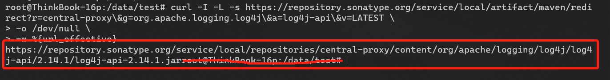

# curl通过自动跳转链接下载文件并保留文件名

原标题：自动跳转的下载地址，curl怎样保留原文件名下载？

作者：老D

---

最近在写 `Jenkinsfile` 的时候遇到了一个场景，需要从一条链接地址下载 `jar` 包，jar 包名字是带版本号的，我是希望不改变原来文件名的情况下去下载到某个目录下。

一开始觉得这个场景需求不难哦，首先想到的是用我比较熟的 `curl` 命令直接下载就应该就可以了，马上开工！

## 第一次失败

我们这次要下载的链接长这样（用 `log4j-api` 的仓库地址举例）：

```sh
https://repository.sonatype.org/service/local/artifact/maven/redirect?r=central-proxy&g=org.apache.logging.log4j&a=log4j-api&v=LATEST
```

先用浏览器打开一下链接，看看能不能正常下载：


没有问题，而且自动下载了最新版本的 jar 包，名字叫 `log4j-api-2.14.1.jar` ，完美的很，现在马上转战 curl 命令。

```ssh
$ curl -O https://repository.sonatype.org/service/local/artifact/maven/redirect?r=central-proxy&g=org.apache.logging.log4j&a=log4j-api&v=LATEST
```

这个大写的 `-O` 参数表示不需要指定文件名，用链接的文件名字来作为文件名。

一个回车下去，问题来了：


出现了很多奇奇怪怪的东西，而且下载下来的文件名变成了 `'redirect?r=central-proxy'`，我们来 `cat` 一下这个文件看看里面有什么线索：


原来是返回了一个 `400 - Bad Request` 的页面，看来是我们的地址有点问题，我们一起来仔细看看这条地址，其实可以看到地址后面有好几个参数：

`r=central-proxy&g=org.apache.logging.log4j&a=log4j-api&v=LATEST`

可以看到里面带了个 `&` 符号，这个符号在 Linux 里是指后台运行，所以我们的地址还不能直接用。

> **知识点一：**
> 
> 这里可以有两种方法解决问题：
>
> - 转义 url，将 `&` 前增加反斜杠 `\&` 。
> - 用 `curl -d` 参数，并且强制使用 `GET` 方法 `-G`。
>
> ```sh
> # 方法一：转义 url
> $ curl -O https://repository.sonatype.org/service/local/artifact/maven/redirect?r=central-proxy\&g=org.apache.logging.log4j\&a=log4j-api\&v=LATEST
> 
> # 方法二：用 curl -d 参数
> $ curl -O -G \
>     https://repository.sonatype.org/service/local/artifact/maven/redirect \
>     -d "r=central-proxy&g=org.apache.logging.log4j&a=log4j-api&v=LATEST"
> ```

## 第二次失败

通过上面两个方法我们又下载了一个东西：


从截图可以看到，我们下载下来的文件名还是不太对，叫做 `'redirect?r=central-proxy&g=org.apache.logging.log4j&a=log4j-api&v=LATEST'`，并不是我们想要的 `log4j-api-2.14.1.jar`，我们继续 `cat` 一下它：


这次文件里面的内容不一样了，里面返回了一段话：

```
If you are not automatically redirected use this url: https://repository.sonatype.org/service/local/repositories/central-proxy/content/org/apache/logging/log4j/log4j-api/2.14.1/log4j-api-2.14.1.jar
```

哇哦，起码服务器正确返回了我们想要的下载地址，但是为什么我们还是下载不到呢？

> **知识点二：**
> 
> 从内容可以猜测，服务器其实是想重定向到里面真正的下载地址然我们下载，我们可以通过参数 `curl -i` 来打印 `HTTP` 的头来看看：
>
> 

从截图可以看到，服务器返回了 `HTTP 307` 的状态码，而且 `Header` 里面有 `location` 的参数，所以证实了我们的想法，那怎么让 `curl` 去自动重定向到服务器返回的地址呢？

> **知识点三：**
>
> 这里我们可以通过用 `curl -L` 参数来解决问题，`-L` 参数表示 `Follow redirects`，就是说告诉 curl 自动重定向到新的链接。

## 第三次失败

感觉要解决这个问题了！我们马上试下：

```sh
$ curl -O -L https://repository.sonatype.org/service/local/artifact/maven/redirect?r=central-proxy\&g=org.apache.logging.log4j\&a=log4j-api\&v=LATEST
```


啊哈，好像成功下载到东西了！从截图可以看到它下载了 `293k` 的东西，跟我们从浏览器下载的大小一样。

但是！为啥文件名还是不对呢，并不是我们想要的 `log4j-api-2.14.1.jar`。

> **知识点四：**
>
> 虽然我们用了 `curl -L` 参数实现了自动重定向到下载链接，但是 `curl -O` 参数只会用到最开始的地址作为下载的文件名。

## 第四次尝试

既然不能直接 `curl -O` ，那有没有办法先拿到真正的下载地址，再用 `curl -O` 去请求地址，那不是可以保留原文件名下载了吗？

先上命令代码：

```sh
$ curl -I -L -s https://repository.sonatype.org/service/local/artifact/maven/redirect?r=central-proxy\&g=org.apache.logging.log4j\&a=log4j-api\&v=LATEST \
-o /dev/null \
-w %{url_effective}
```

> **知识点五：**
> 这个命令里面有很多知识点要介绍下：
>
> 1. `curl -I` 参数表示只打印信息，不会真正下载
> 2. `curl -s` （小写）参数表示静默模式
> 3. `curl -o /dev/null` （小写）表示将输出的东西重定向到 `/dev/null` 丢弃
> 4. `curl -w %{url_effective}`（小写）表示输出最后的 `url` 地址

所以通过上面的命令，我们能够获取到最后的下载地址了：



## 第五次成功

既然我们都获取到真正的下载地址了，那么我们拿着这个地址再用 `curl` 不就可以达到我们想要的效果了吗？

马上上命令代码：

```sh
$ curl -I -L -s https://repository.sonatype.org/service/local/artifact/maven/redirect?r=central-proxy\&g=org.apache.logging.log4j\&a=log4j-api\&v=LATEST \
-o /dev/null \
-w %{url_effective} \
| xargs curl -O
```


终于成功！ 我们再优化一下上面的命令，可以得到最后我们要的命令代码：

```sh
$ curl -GILs https://repository.sonatype.org/service/local/artifact/maven/redirect \
-d "r=central-proxy&g=org.apache.logging.log4j&a=log4j-api&v=LATEST" \
-o /dev/null \
-w %{url_effective} \
| xargs curl -O
```
